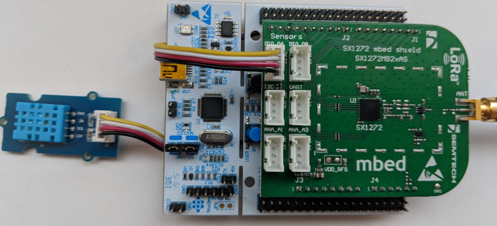
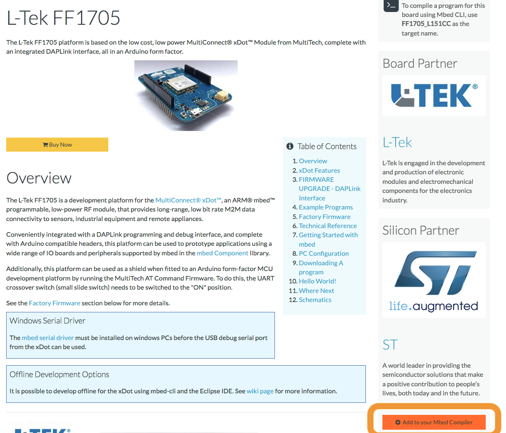
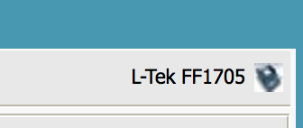
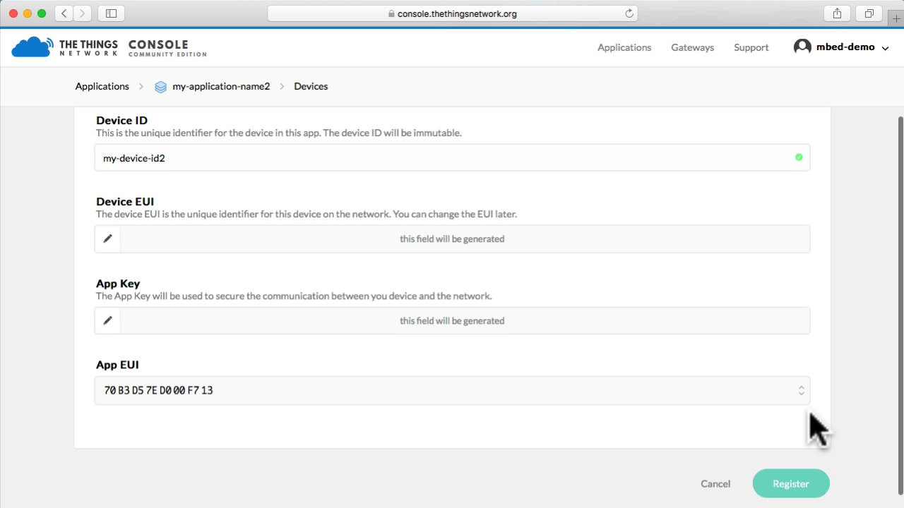
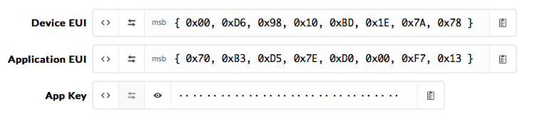
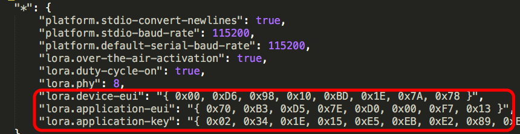
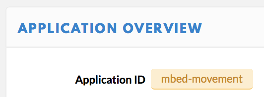

# IoT Deep Dive - LoRaWAN

Welcome to the IoT Deep Dive session on LoRaWAN. If you have any questions, please just give a shout. We are here to help.

In this session you'll be building some examples, introducing you to:

1. Building IoT devices with [Arm Mbed OS](https://os.mbed.com/).
1. Connecting your device to [The Things Network](https://www.thethingsnetwork.org/) using LoRaWAN.
1. Data visualization through the TTN API.

In case you're stuck, this document will help you get back on track. If you're a fast learner, there are "extra credit" assignments at the end of this workbook. Please help your neighbors as well. :-)

## Prerequisites

1. Create an Arm Mbed online account [here](https://os.mbed.com/account/signup/).
1. Then install the following software for your operating system below:

**Windows**

If you are on Windows, install:

1. [Arm Mbed Windows serial driver](http://os.mbed.com/media/downloads/drivers/mbedWinSerial_16466.exe) - serial driver for the board.

    **Note:** Not needed on Windows 10.

1. [Tera term](https://osdn.net/projects/ttssh2/downloads/66361/teraterm-4.92.exe/) - to see debug messages from the board.
1. [Node.js](https://nodejs.org/en/download/) - to show visualizations.

**Linux**

If you're on Linux, install:

1. screen - e.g. via `sudo apt install screen`
1. [Node.js](https://nodejs.org/en/download/) - to show visualizations.

**MacOS**

If you're on MacOS, install:

1. [Node.js](https://nodejs.org/en/download/) - to show visualizations.

## Building the circuit

We're using the [L-TEK FF1705](https://os.mbed.com/platforms/L-TEK-FF1705/) development board, which contains the Multi-Tech xDot module. In addition, you can use a Grove temperature & humidity sensor. Let's connect these sensors and verify that the board works.

Grab the following items:

* Development board.
* Micro-USB cable.
* Grove temperature and humidity sensor.
* Grove connector to male jumper wires.

Click the Grove connector onto the temperature sensor. Connect the wires to the development board like this:

* Red -> 5V
* Black -> GND
* Yellow -> SPI_MISO



## 1. Building an application

Now let's build a simple application which reads the sensor data and prints it to the serial console.

1. Go to [https://os.mbed.com](https://os.mbed.com) and sign up (or sign in).
1. Go to the [L-TEK FF1705](https://os.mbed.com/platforms/L-TEK-FF1705/) platform page and click *Add to your Mbed compiler*.

    

1. Import the example program into the Arm Mbed Compiler by clicking [this link](https://os.mbed.com/compiler/#import:https://github.com/armmbed/iot-deep-dive-lorawan).
1. Click *Import*.
1. In the top right corner make sure you selected 'L-TEK FF1705'.

    

This has cloned the repository. Now it's time to create some keys for this device so it can join the network.

Open `mbed_app.json` and locate `lora.device-address`.

## 2. Connecting to The Things Network

We need to program some keys in the device. LoRaWAN uses an end-to-end encryption scheme that uses two session keys. The network server holds one key, and the application server holds the other. (In this tutorial, TTN fulfils both roles). These session keys are created when the device joins the network. For the initial authentication with the network, the application needs its device EUI, the EUI of the application it wants to join (referred to as the application EUI) and a preshared key (the application key). Because the number of people in this workshop we're programming the session keys in directly. This is not safe and should not be done in production!

Let's register this device in The Things Network and grab some keys!

### Connecting to The Things Network

#### Setting up

1. Go to [The Things Network Console](https://console.thethingsnetwork.org)
2. Login with your account or click [Create an account](https://account.thethingsnetwork.org/register)

   

   >The Console allows you to manage Applications and Gateways.

3. Click **Applications**
4. Click **Add application**
5. Enter a **Application ID** and **Description**, this can be anything
6. Be sure to select `ttn-handler-us-west` in **Handler registration**

   

   >The Things Network is a global and distributed network. Selecting the Handler that is closest to you and your gateways allows for higher response times.

7. Click **Add application**

   

   >LoRaWAN devices send binary data to minimize the payload size. This reduces channel utilization and power consumption. Applications, however, like to work with JSON objects or even XML. In order to decode binary payload to an object, The Things Network supports [CayenneLPP](https://www.thethingsnetwork.org/docs/devices/arduino/api/cayennelpp.html) and Payload Functions: JavaScript lambda functions to encode and decode binary payload and JSON objects. In this example, we use CayenneLPP.

8. Go to **Payload Format** and select **CayenneLPP**

   

#### Registering your Device

1. In your application, go to **Devices**
1. Click **register device**
1. Enter a **Device ID**
1. Look very closely at the Multi-Tech xDot on your L-Tek FF1705, the **Device EUI** is printed after **NODE**:

   

   >The EUI starts with `00:80:00:00:...`. Enter without the colons.

   

   >You can leave the Application EUI to be generated automatically.

1. Click **Register**

   

1. Click **Settings**.

    

1. Switch to **ABP**.

    

1. Disable (or uncheck) frame counter checks.

    

1. Click **Save**.

Now we need to get the device address, network session key and application session key.

1. Click the **Copy** button next to 'Device Address' to copy to clipboard.

    

1. Click the `< >` button of the **Network session key** and **Application session key** values to show the value as C-style array.
1. Click the **Copy** button on the right of the value to copy to clipboard.


#### Pasting them in the Online Compiler

In the Online Compiler now open `mbed_app.json`, and paste the keys in:



**Note:** Make sure to put `0x` in front of device address!!! (i.e. `"lora.device-address": "0x26021CED",`)

Now compile the application:

1. Click *Compile*.

    

1. A binary (.bin) file downloads, use drag-and-drop to copy the file to the DAPLINK device (like a USB mass storage device).

    **Note:** Here's a [video](https://youtu.be/L5TcmFFD0iw?t=1m25s).

1. When flashing is complete, hit the **RESET** button on the board (next to USB).

The board should now connect to The Things Network. Inspect the *Data* tab in the TTN console to see the device connecting.


## 3. Showing logs

Something not right? Let's inspect the logs... If all is well, you should see something similar to:

```
LoRaWAN stack initialized
Connection - In Progress ...
Connection - Successful
Sensor value is 26.00
4 bytes scheduled for transmission
```

#### Windows

To see debug messages, install:

1. [Arm Mbed Windows serial driver](http://os.mbed.com/media/downloads/drivers/mbedWinSerial_16466.exe) - serial driver for the board.
    * See above for more instructions.
    * No need to install this if you're on Windows 10.
1. [Tera term](https://osdn.net/projects/ttssh2/downloads/66361/teraterm-4.92.exe/) - to see debug messages from the board.

When you open Tera Term, select *Serial*, and then select the Mbed COM port.


#### MacOS

No need to install a driver. Open a terminal and run:

```
screen /dev/tty.usbm            # now press TAB to autocomplete and then ENTER
```

To exit, press: `CTRL+A` then `CTRL+\` then press `y`.

#### Linux

If it's not installed, install GNU screen (`sudo apt-get install screen`). Then open a terminal and find out the handler for your device:

```
$ ls /dev/ttyACM*
/dev/ttyACM0
```

Then connect to the board using screen:

```
sudo screen /dev/ttyACM0 9600                # might not need sudo if set up lsusb rules properly
```

To exit, press `CTRL+A` then type `:quit`.

## 4. Getting data out of The Things Network

To get some data out of The Things Network you can use their API. Today we'll use the Node.js API, but there are many more.

First, you need the application ID and the application key.

1. Open the TTN console and go to your application.
1. Your application ID is noted on the top, write it down.

    

1. Your application Key is at the bottom of the page. Click the 'show' icon to make it visible and note it down.

    

With these keys we can write a Node.js application that can retrieve data from TTN.

1. Open a terminal or command prompt.
1. Create a new folder:

    ```
    $ mkdir ttn-api
    $ cd ttn-api
    ```

1. In this folder run:

    ```
    $ npm install ttn
    ```

    **Note:** You can ignore the `ENOENT: no such file or directory` errors.

1. Create a new file `server.js` in this folder, and add the following content (replace YOUR_APP_ID and YOUR_ACCESS_KEY with the respective values from the TTN console):

    ```js
    let TTN_APP_ID = 'YOUR_APP_ID';
    let TTN_ACCESS_KEY = 'YOUR_ACCESS_KEY';

    const ttn = require('ttn');

    TTN_APP_ID = process.env['TTN_APP_ID'] || TTN_APP_ID;
    TTN_ACCESS_KEY = process.env['TTN_ACCESS_KEY'] || TTN_ACCESS_KEY;

    ttn.data(TTN_APP_ID, TTN_ACCESS_KEY).then(client => {
        client.on('uplink', (devId, payload) => {
            console.log('retrieved uplink message', devId, payload);
        });

        console.log('Connected to The Things Network data channel');
    });
    ```

1. Now run:

    ```
    $ node server.js
    ```

The application authenticates with the The Things Network and receives any message from your device.

## 5. Making a dashboard / extra credit

* You can use Cayenne MyDevices to create a dashboard. Instructions are [here](https://www.thethingsnetwork.org/docs/applications/cayenne/).
* Add readings from the humidity sensor, and send them to the dashboard too.

## 6. A map with sensors...


Got everything working? Add your sensor to the map! Go to http://ec2-52-211-146-247.eu-west-1.compute.amazonaws.com:7271/ and put your application ID in the top right corner. When prompted, add your access key!

Want to hack on the map code? It's on [GitHub](https://github.com/janjongboom/ttn-sensor-maps).


**Add coverage**

The Things Network is a collaborative network. You can extend the network yourself by placing a gateway, or you can use existing coverage from community members. See [The Things Network Map](https://www.thethingsnetwork.org/map) to see if there is coverage in your area or region.

Setting up a gateway is easy and becomes more and more affordable. Here are two recommended options:

1. The highly configurable [Multi-Tech Conduit](https://www.digikey.com/en/product-highlight/m/multi-tech-systems/iot-platform); you need an `MTAC-LORA-915` or `MTAC-LORA-868` depending [on your country](https://www.thethingsnetwork.org/docs/lorawan/frequencies-by-country.html), as well as a `MTCDT` Conduit;
1. The Things Network's own product, [The Things Gateway 915 MHz](http://www.newark.com/productimages/standard/en_US/05AC1807-40.jpg) or [The Things Gateway 868 MHz](http://uk.farnell.com/the-things-network/ttn-gw-868/the-things-gateway-eu/dp/2675813)
