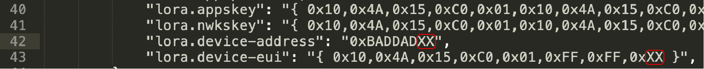

# LoRa Bootcamp - Semtech + Arm Mbed OS + Comcast MachineQ

This workshop is designed to work with the Comcast MachineQ LoRa network. The settings on this project have been modified to specially work with Machine Q. 

## Pre-requisites
For this workshop you will need a few things

1. [Arm Mbed Account](http://os.mbed.com/signup) - Signup for online compiler account to compile code
1. [Comcast Machine Q account](https://mqcentral.machineq.net/) - use as LoRa backend to view data
1. **Proctor Only** upload all devices for the workshop into MachineQ via bulk upload. The .xls spreadsheets are attached in this repo for ease of use. 

## Hardware
In this workshop we will be using the [ST Disco LoraWan board](https://os.mbed.com/platforms/ST-Discovery-LRWAN1/) and the [ST Sensor board IKS01A2](https://os.mbed.com/components/X-NUCLEO-IKS01A1/). Go ahead and plug them together

## Background
Today we will be sending data in the [Cayenne Low Power payload](https://mydevices.com/cayenne/docs/lora/#lora-cayenne-low-power-payload) format. This format optimizes data with a bit of meta data to minimize the actual data being used on the network. This is super handy for LoRa where every byte counts!

## Coding Time!
Lets get some code running!

1. Add your device to your online compiler account by [clicking here](https://os.mbed.com/platforms/ST-Discovery-LRWAN1/add/) - or go to the platform page and click the 'Add to my compiler' button. 
    
1. Import the code example by [clicking here](http://os.mbed.com/compiler/#import:https://github.com/BlackstoneEngineering/lorawan-bootcamp-indy-2018) or by importing the program from `https://github.com/BlackstoneEngineering/lorawan-bootcamp-indy-2018` .
1. Modify the `mbed_app.json` file. You will need to change the `device-address` and `device-eui` fields to match the piece of paper you were given. Change the last two digists `XX` to match the number you were given.
    
1. Compile your code by pressing the `compile` button. 
1. Drag and drop the binary to your board to program it. 

## Debugging
To view the output of your board lets hook up a serial terminal to the board at 115200 baud. This will let you view the sensor values being read and sent across the network. 

#### Windows

To see debug messages, install:

1. [Arm Mbed Windows serial driver](http://os.mbed.com/media/downloads/drivers/mbedWinSerial_16466.exe) - serial driver for the board.
    * See above for more instructions.
    * No need to install this if you're on Windows 10.
1. **Serial Terminal** - [Cool Term](https://freeware.the-meiers.org/). 

Make sure to change the baudrate under **Options**->**Baudrate** then press the **Connect** button at the top. 

#### OS/X

No need to install a driver. Use [Cool Term](https://freeware.the-meiers.org/). Make sure to change the port under **Options**->**Port** and change the baudrate to 115200. Then press Connect. 

#### Linux

If you're on linux you should know what to do, either use screen or minicom. The boards usually show up under `/dev/tty...`, make sure to use a baudrate of 115200 at 8-n-1 . 

Once you have the terminal hooked up you should see data that looks like the following

## View MachineQ Dashboard
Go to your dashboard view and add a viewer for your device. If you have number `01` for example you will create a dashboard for `Workshop-Device-01`.

## Extra Credit
- Turn on verbose debugging by turning on the value `"mbed-trace.enable": true,` in  `mbed_app.json`.
- Change the temerature values to be send as farenheight instead of celcius.
